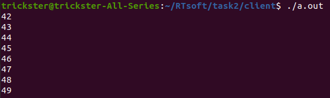

# Установка драйвера и устройства

> исходный код драйвера находится в файле driver/test.c

Скомпилируйте драйвер

```
$ cd driver
$ make
```

Установите драйвер

```
$ sudo insmod test.ko
```

Проверьте в логах major number устройства, для которого зарегистрирован драйвер

```
$ dmesg | tail
```

В ответ вы получите сообщение содержащее строку следующего вида, содержащую major number

```
[829528.598926] Please, create a dev file with 'mknod /dev/test c 249 0'
```

Выполните предписанную в нем команду и добавьте устройство в систему (имя /dev/test/ принципиально, как и major number из сообщения выше)

```
$ sudo mknod /dev/test c 249 0
```

# Проверка драйвера через приложение на Си
Соберите файл приложения
```
$ cd client
$ gcc client.c
```

Запустите приложение

```
$ ./a.out
```

Вы увидете арифметическую последовательность значений счетчика драйвера (запрос выполняется 1 раз в секунду)

```
trickster@trickster-All-Series:~/RTsoft/task2/client$ ./a.out
60
61
62
63
64
65
66
```

# Скриншот работы


