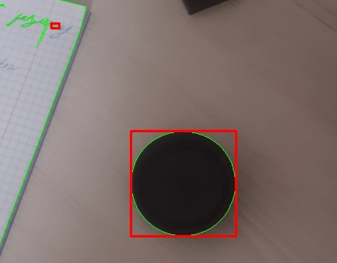

# Запуск программы

> Из-за сложных зависимостей между графическими библиоткеами, используемыми openCV не удалось корректно запустить программу в Docker

Установите библиотеку openCV

```
$ pip install opencv-python
```

Запустите программу

```
$ cd src
$ python3 main.py
```

# Скриншот работы программы

Зеленые линии - границы контрастного объекта, красные прямоугольники - рамка вокруг контрастного объекта


