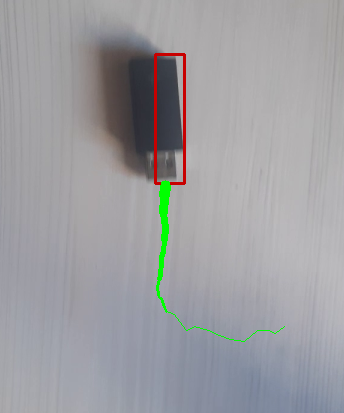
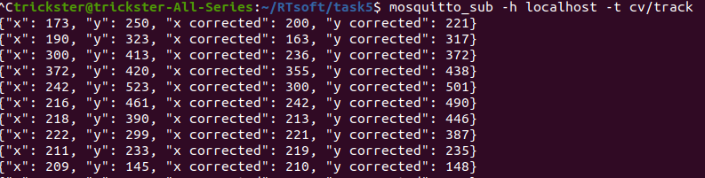

# Запуск программы

> Из-за сложных зависимостей между графическими библиоткеами, используемыми openCV не удалось корректно запустить программу в Docker

Установите библиотеки openCV и MQTT

```
$ pip install opencv-python
$ pip install paho-mqtt
```

Запустите программу

```
$ cd src
$ python3 main.py
```

Установите клиент MQTT

```
$ sudo apt-add-repository ppa:mosquitto-dev/mosquitto-ppa
$ sudo apt-get update
$ sudo apt-get install mosquitto mosquitto-clients
```

Запустите клиент MQTT с темой cv/track

```
$ mosquitto_sub -h localhost -t cv/track
```

Каждые 10 кадров программа публикует MQTT-сообщение с текущими координатам без коррекции и координатами с учетом коррекции по скользящему среднему

```
trickster@trickster-All-Series:~/RTsoft/task5$ mosquitto_sub -h localhost -t cv/track
{"x": 173, "y": 250, "x corrected": 200, "y corrected": 221}
{"x": 190, "y": 323, "x corrected": 163, "y corrected": 317}
{"x": 300, "y": 413, "x corrected": 236, "y corrected": 372}
{"x": 372, "y": 420, "x corrected": 355, "y corrected": 438}
{"x": 242, "y": 523, "x corrected": 300, "y corrected": 501}
{"x": 216, "y": 461, "x corrected": 242, "y corrected": 490}
```

# Скриншот работы программы

Зеленая линия - сглаженная посредством подсчета скользящего среднего траектория объекта

Красные прямоугольники - рамка вокруг контрастного объекта



MQTT-сообщения

