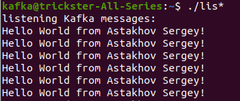

# Kafka
> не удалось поместить программу в docker-контейнер из-за проблем с запуском сервисов в контейнерах

## Запуск

- [Установите Kafka согласно инструкции](https://www.digitalocean.com/community/tutorials/how-to-install-apache-kafka-on-ubuntu-20-04) 

- Перейдите в папку ./task6/start up

- Запустите скрипт copy_script.sh (он скопирует сценарии запуска в директории пользователя kafka)

  ```
  $ sudo ./copy_script.sh
  ```

- Откройте два окна терминала от имени пользователя kafka

  ```
  $ su -l kafka
  ```
  
- В первом терминале запустите просмотр consumer (порядок запуска важен!)

  ```
  $ ./listen.sh
  ```

- Во втором терминале запустите producer (сообщения посылаются раз в секунду)

  ```
  $ ./producer.sh
  ```
## Вывод программы

```
kafka@trickster-All-Series:~$ ./lis*
listening Kafka messages:
Hello World from Astakhov Sergey!
Hello World from Astakhov Sergey!
Hello World from Astakhov Sergey!
Hello World from Astakhov Sergey!
Hello World from Astakhov Sergey!
```

## Скриншоты




