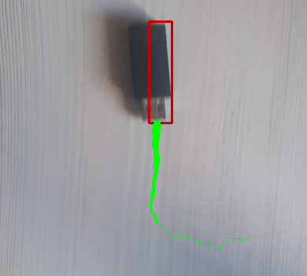
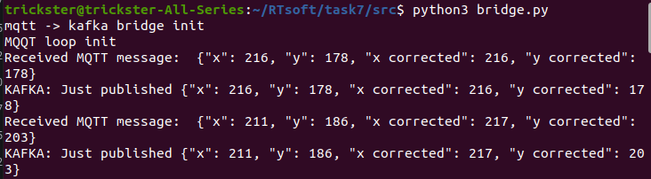
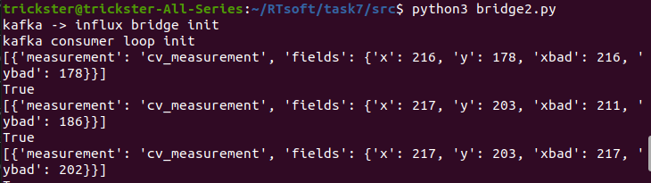
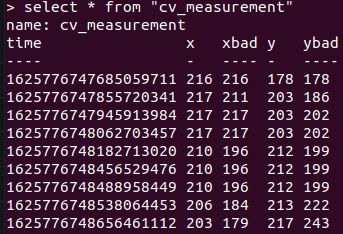
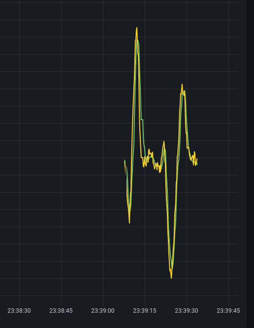
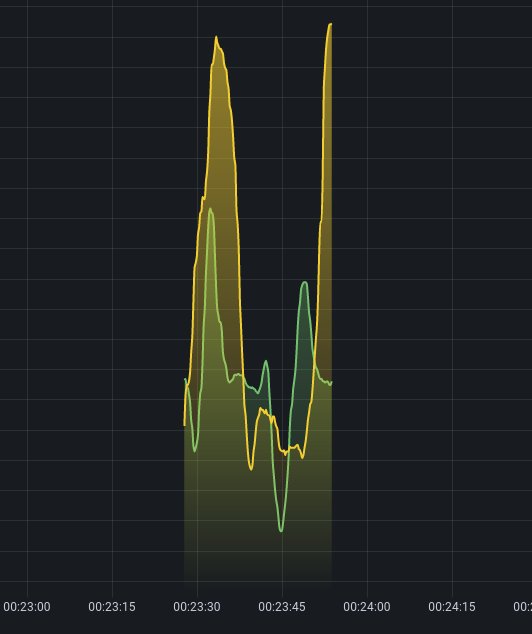

# Open CV, influxDB, Grafana

## Архитектура системы

- Распознаватель (main.py)
- bridge Mqtt -> Kafka (bridge.py)
- Kafka broker
- bridge Kafka -> influxDB (bridge2.py)
- influxDB
- Grafana

## Скриншоты работы

Работа распознавателя

Лог моста mqtt - kafka

Лог моста kafka - influxDB

Содержимое influxDB

График координаты х(t) с учетом и без учета коррекции по скользящему среднему

График координат х(t) и y(t) с учетом коррекции по скользящему среднему

## Примерный порядок установки

> Программа сложно переносима, данный раздел приведен прежде всего в ознакомительных целях

- Установить и запустить сервисы kafka, influxDB, grafana согласно официальным руководствам по установке и используя параметры по умолчанию (параметры пользователя influxDB не важны)
- Установить python-библиотеки согласно requirments.txt
- Запустить программные мосты (bridge.py и bridge2.py)
- Запустить основную программу (main.py)
- Сконфигурировать grafana под необходимые данные
