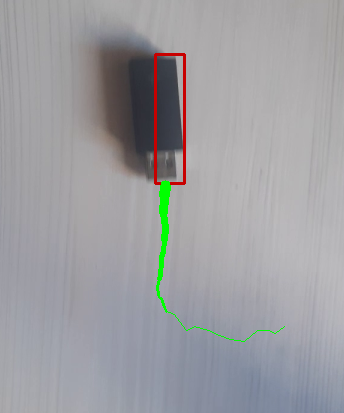
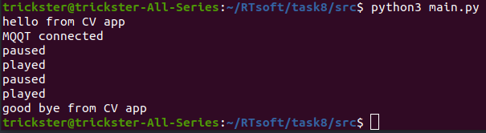
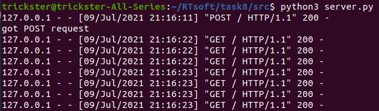
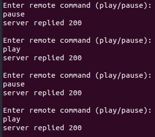

# OpenCV + Rest

## Архитектура

- основная программа (main.py)
- промежуточный http-сервер (server.py)
- управляющая программа (remote.py)

## Порядок запуская

- установить необходимые библиотеки через pip
- запустить программы в следующем порядке
```
$ python3 server.py
$ python3 remote.py
$ python3 main.py
```
По умолчанию видео находится в режиме play,  для преключения режимов следуйте подсказкам remote.py

## Скриншоты

GUI основной программы (main.py)



Лог основной программы (main.py)



Лог http-сервера (server.py)



Интерактивная консоль управляющей программы (remote.py)

